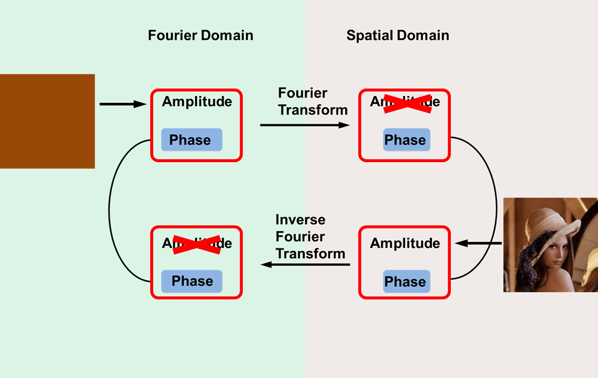
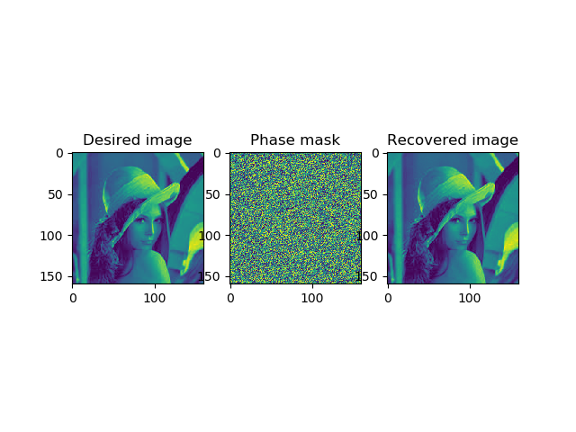

# Phase_retrieval_single_constraint
This is an implementation of phase retrieval using Gerchberg-Saxton algorithm

The basic algorithm works as below: 



Apply the Gerchberg-Saxton algorithm to recovery the phase-only mask by running 
```
demo_main.py
```
The result is shown as below:



For more information pleaser refer to https://doi.org/10.1364/OE.27.003799
